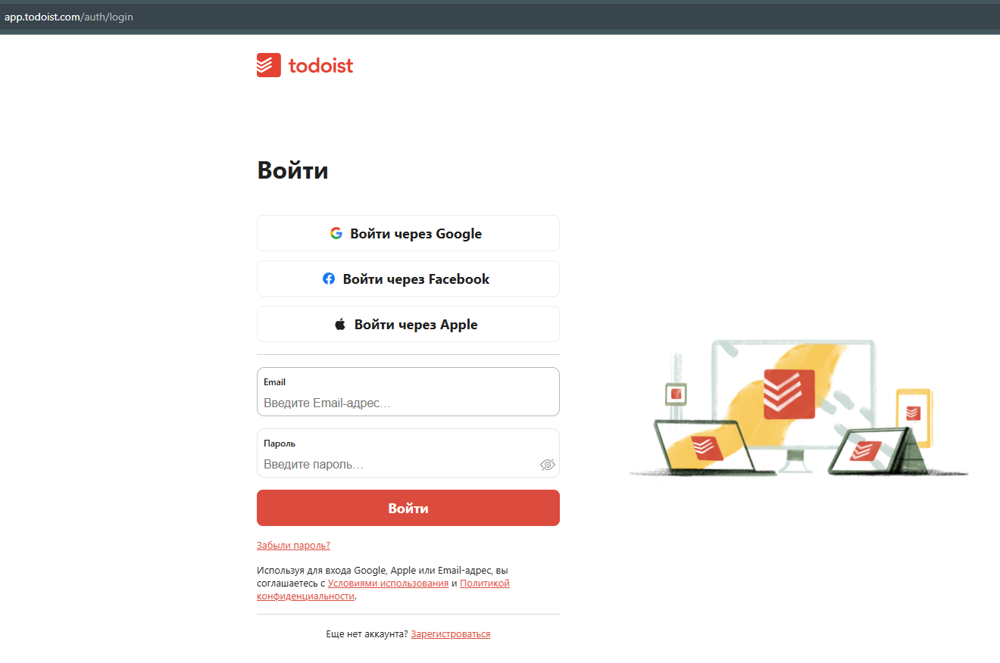

# Тестовый фреймворк. UI & API test automation

[Todoist]("https://todoist.com/")

> UI- и API-фреймворк на Java для автоматизированного тестирования функциональности регистрации, авторизации, 
> восстановления пароля и поиска в системе todoist.com. 
> Проект разделён на модули для поддержания архитектуры.

---
## Стек технологий и инструментов:
- Java 11+ 
- Selenium WebDriver
- TestNG 
- REST Assured 
- Faker 
- WebDriverManager
- Maven
- Properties (Config.properties)
- Postman
- DevTools

---

## UI Тестовые сценарии:
### Стартовая страница: 
- Переход на страницу авторизации
- Переход на страницу регистрации

### Страница регистрации:
- Успешная регистрация c валидными данными
- Email уже используется в приложении
- Валидация пустых полей

### Страница авторизации:
- Вход с валидными данными
- Использование невалидного емейла
- Валидный емейл и невалидный пароль
- Отправка формы с пустыми полями
---

## API Тестовые сценарии:
- Вход с валидными данными
- Использование невалидного емейла
- Валидный емейл и невалидный пароль
- Пустые поля
- Запрос на восстановление пароля с валидным емейлом
- Запрос на восстановление пароля с невалидным емейлом
- Ипользование поля поиска в Help Center модуле
---
## Генерация данных

1) Все чувствительные данные хранятся в Config.properties

2) Email и пароли генерируются через Faker:
- generateValidEmail()
- generateInvalidEmail()
- generatePassword()

### Irina Evminova
